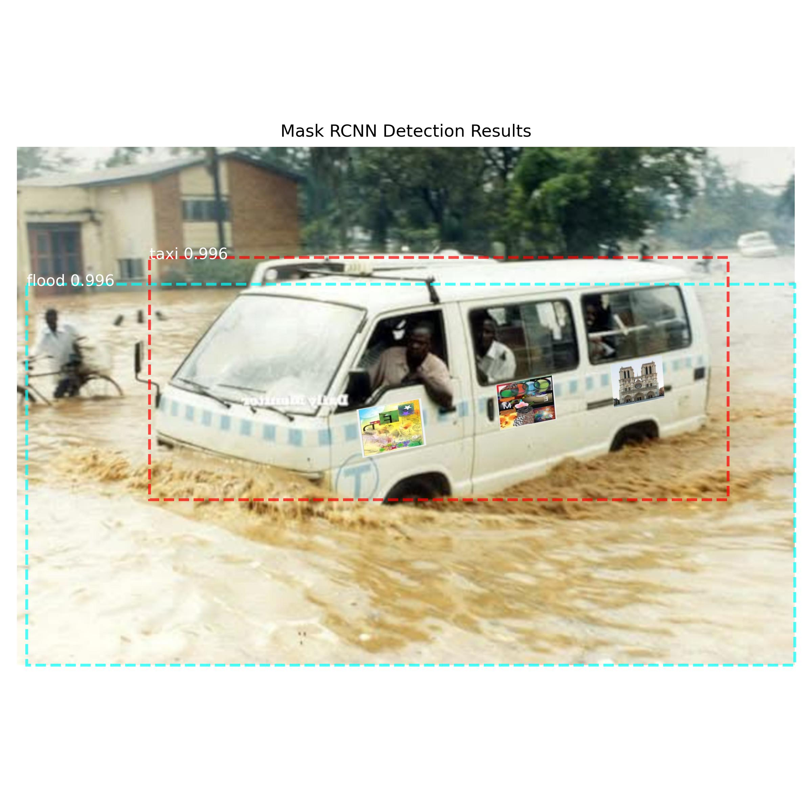
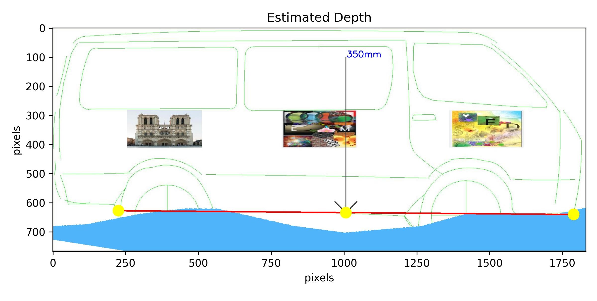

# Estimating Flood Depth Using Mask R-CNN and Image Registration

## **Overview**

This project aims to estimate flood depth from images using <strong>Mask R-CNN</strong> to detect flooded regions and a reference object (Taxi). A CNN model based off Mask RCNN architecture has been trained to identify flooded regions and Taxis from porvided images. The Taxis are assumed to have special distinct labels(banners). Once the taxi has been identified, a homography matrix is computed using Scale Invariant Feature Transform (SIFT) to estabish correspondence between the input image and a reference image. The reference contains the outline of a taxi with the special banners, with an added advantage that this is a calibrated space. That is to say, the real pixel dimensions are known in the reference image.

## **Methodology**

**Flood and Taxi Detection:** Use **Mask R-CNN** trained to detect flooded areas and taxis.

**Image Registration:** Extract a **subimage of the taxi** from the detected region.  

Match the detected taxi with **reference image**and compute homography matrix.  
 

**Flood Depth Estimation:** Warp the flood mask onto the reference image.and compute depth  
   
 

## Contributors

- **Wasswa Ian Senjinja** - Research & Development
- **Nyankunyi Martin** - Research & Development

## Repository

Source code for this project is available at:

[👉 Mask R-CNN GitHub Repository](https://github.com/pscholar/FYP_CNN)

## Credits

This project utilizes **Mask R-CNN** architecture for instance segmentation. Mask R-CNN was developed by **Matterport** and is available at:

[👉 Mask R-CNN GitHub Repository](https://github.com/matterport/Mask_RCNN)

## License

This project is licensed under the **MIT License**. See [LICENSE](LICENSE) for details.
